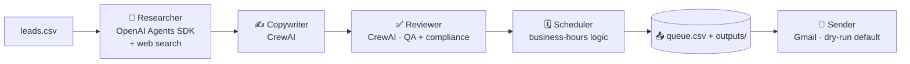

# 🩺 HayMedics Outreach Studio

**AI agents that research each lead, write a personalised cold email, and prepare it for sending — running entirely on free-tier AI.**

Built for the **CiphezNexus Hackathon** by Awal Olalekan Abdulrahman (https://github.com/HayMedics).

Give the system a list of leads and a campaign goal. A research agent looks each lead up on the web, a copywriter drafts a personalised email, a reviewer checks it for quality and compliance, and a scheduler queues it — with a human review gate before anything is ever sent.

---

## ✨ What it does

- **Researches every lead** automatically with live web search — company, role, a real recent hook, and a likely pain point.
- **Writes a personalised cold email** grounded in that research — no generic templates.
- **Reviews for quality + compliance** — trims spam-trigger words, checks claims match the research, and adds a polite opt-out line.
- **Schedules send times** across business hours (weekdays, 9am–5pm, spaced out).
- **Sends safely via Gmail** — dry-run by default, skips dummy/opted-out addresses, and throttles between sends.
- **Branded Streamlit dashboard** to run the whole thing from your browser.

---

## 🏗️ How it works

Each lead flows through a four-stage pipeline, using the right tool for each job:



| Stage | Tool | Why this tool |
|-------|------|---------------|
| Research | OpenAI Agents SDK + DuckDuckGo | Strong at a single agent looping over a tool (web search) |
| Copywriting + Review | CrewAI | Built for role-based agents collaborating on content |
| Scheduling | Plain Python | No AI needed — code is simpler and more reliable |
| Sending | Gmail (smtplib) | Free, wrapped in safety guardrails |

---

## 🧰 Tech stack

- **Python**, managed with [uv](https://docs.astral.sh/uv/)
- **[OpenAI Agents SDK](https://openai.github.io/openai-agents-python/)** — research agent
- **[CrewAI](https://www.crewai.com/)** — copywriter + reviewer crew
- **[OpenRouter](https://openrouter.ai/)** free models — LLM access at zero cost
- **DuckDuckGo** (`ddgs`) — keyless web search
- **[Streamlit](https://streamlit.io/)** — branded dashboard
- **Gmail SMTP** — email delivery

---

## 📁 Project structure

```
email-outreach-agent/
├── research_agent.py     # Stage 1: research a lead (OpenAI Agents SDK + web search)
├── outreach_crew.py      # Stage 2: write + review the email (CrewAI)
├── main.py               # Orchestrator: leads.csv -> pipeline -> queue.csv
├── sender.py             # Safe Gmail sender (dry-run by default)
├── app.py                # HayMedics Streamlit dashboard
├── leads.csv             # Your target list
├── assets/
│   └── haymedics_logo.png
├── outputs/              # Generated emails + queue.csv
└── .env                  # API keys (never committed)
```

---

## 🚀 Getting started

**Prerequisites:** Python 3.11–3.13 and [uv](https://docs.astral.sh/uv/).

1. **Clone and install**
   ```bash
   git clone https://github.com/HayMedics/<your-repo>.git
   cd email-outreach-agent
   uv sync
   ```

2. **Add your keys** — create a `.env` file:
   ```
   OPENROUTER_API_KEY=sk-or-your-key

   # Optional — only needed to actually send emails:
   GMAIL_ADDRESS=you@gmail.com
   GMAIL_APP_PASSWORD=your16charapppassword
   ```
   Get a free OpenRouter key at [openrouter.ai/keys](https://openrouter.ai/keys). For sending, use a Gmail [App Password](https://myaccount.google.com/apppasswords) (requires 2-Step Verification).

3. **Add your leads** to `leads.csv`:
   ```csv
   name,role,company,email
   Amara Okafor,Head of Partnerships,Flutterwave,amara@example.com
   ```

---

## 🖥️ Usage

**Option A — Web dashboard (recommended)**
```bash
uv run streamlit run app.py
```
Set your campaign in the sidebar, upload leads (or use the samples), click **Generate**, review the drafts, then preview or send.

**Option B — Command line**
```bash
uv run python main.py           # research + write + schedule every lead
uv run python sender.py         # DRY RUN — shows what would send, sends nothing
uv run python sender.py --send  # actually send (skips dummies + opt-outs)
```

---

## 🛡️ Responsible use

This tool is for **legitimate B2B outreach** to people with a plausible interest — not spam. Safeguards are built in:

- The **reviewer agent** adds a clear opt-out line, identifies the sender, and blocks invented claims.
- The **sender is dry-run by default** and only sends with an explicit `--send` flag (or confirmation in the UI).
- It **automatically skips** test/dummy addresses and anyone on your opt-out list (`suppression.csv`).
- Sends are **throttled** to avoid spam-like bursts.

Always follow applicable law (e.g. CAN-SPAM, GDPR, Nigeria's NDPR) and only email people who expect to hear from you.

---

## 🗺️ Roadmap

- Reply / bounce detection to auto-update the queue
- A/B testing of subject lines
- CRM / Google Sheets integration for lead lists
- OAuth support for Google Workspace accounts
- Open + reply analytics

---

## 👤 Author

Built by **Awal Olalekan Abdulrahman** — applying AI and data science to real health and business problems across Africa. [github.com/HayMedics](https://github.com/HayMedics)

*Submitted to the CiphezNexus Hackathon.*